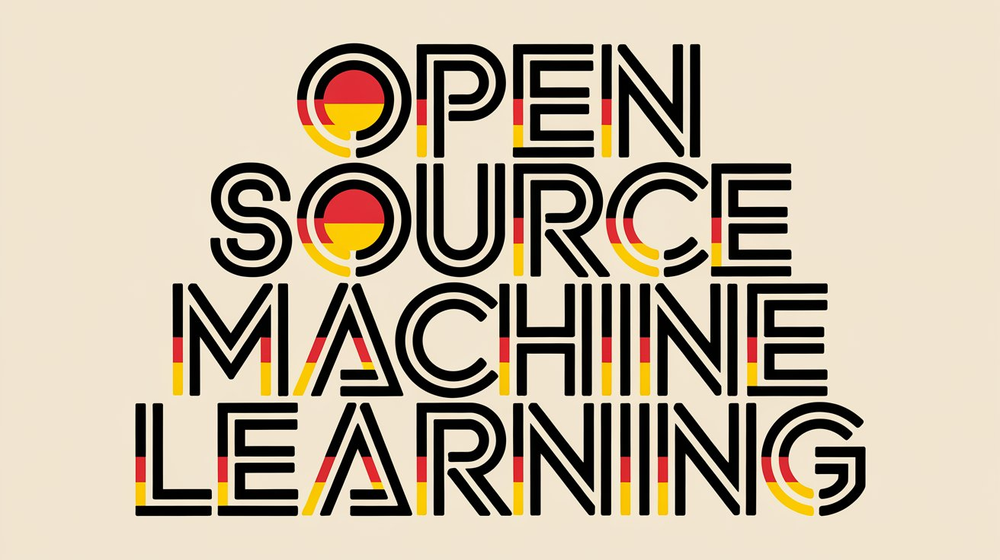
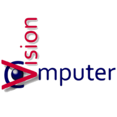
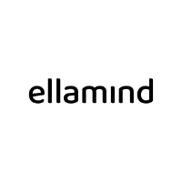
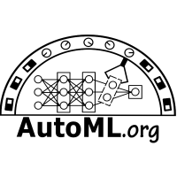

<h1 align="center"> Awesome German Open Source Machine Learning</h1>

This repo contains an overview of open source machine learning projects and companies providing these, which are based in Germany.

A criteria for getting listed here, is that the roots of the project are in Germany or at least a big part of the developers working on the project/for the company are located within Germany.

Contributions to this list are very welcome 🤗 Be it corrections, additions or suggestions - feel free to open an Issue or Pull Request.

## Categories
Following are different categories of Machine Learning and the corresponding projects, including links to their social media representations

> **Activity:** 🟢 < 30 days &nbsp;·&nbsp; 🟡 30–180 days &nbsp;·&nbsp; 🔴 > 180 days &nbsp;·&nbsp; ⬜ N/A &nbsp;—&nbsp; updated weekly by [GitHub Actions](.github/workflows/update-activity.yml)

### 📚 Natural Language Processing (NLP)

The projects listed here all provide frameworks to perform Natural Language Processing tasks.

| Name &nbsp;&nbsp;&nbsp;&nbsp;&nbsp;&nbsp;&nbsp;&nbsp;&nbsp;&nbsp;&nbsp;&nbsp;&nbsp;&nbsp;&nbsp;| Description | Activity | Links|
| :--- | :--- | :---: | :--- |
|   [Explosion](https://github.com/explosion) | Best known for the [spaCy](https://github.com/explosion/spacy) library, one of the most popular Python packages for everything NLP. It pays off to check their profile for other great repos like [spacy-llm](https://github.com/explosion/spacy-llm) and [curated-transformers](https://github.com/explosion/curated-transformers) | <!-- REPO:explosion/spaCy -->⬜<!-- /REPO --> |     
|   [deepset](https://github.com/deepset-ai) | Another young Berlin based company, best known for their LLM framework [Haystack](https://github.com/deepset-ai/haystack) (v2.28, 25k+ GitHub stars). Their first step into the limelight was by training a [BERT based German language model](https://huggingface.co/deepset/gbert-base). In April 2026 they announced a partnership with Mozilla to build a Sovereign AI Stack, combining Mozilla's Thunderbolt AI client with Haystack for privacy-first European AI infrastructure. | <!-- REPO:deepset-ai/haystack -->⬜<!-- /REPO --> |     
|   [flair](https://github.com/flairnlp) | Developed at the Humboldt University Berlin, flair is a simple and powerful framework for state-of-the-art NLP.| <!-- REPO:flairNLP/flair -->⬜<!-- /REPO --> |   
|   [deepL](https://github.com/DeepLcom) | Based in Cologne, DeepL provides a great machine translation quality, especially for German, since 2017. With their [open source library](https://github.com/DeepLcom/deepl-python), their technology is easily integrated into every python project.| <!-- REPO:DeepLcom/deepl-python -->⬜<!-- /REPO --> |    
|   [small-text](https://github.com/webis-de/small-text) | Originating from a research project at Leipzig University, [small-text](https://github.com/webis-de/small-text) offers a modular and comprehensive Python library for building experiments and applications focused on [active learning for text classification](https://aclanthology.org/2023.eacl-demo.11/). | <!-- REPO:webis-de/small-text -->⬜<!-- /REPO --> |  
|  [CAIDAS / LSX-UniWue](https://huggingface.co/LSX-UniWue) | Research group from the Center for Artificial Intelligence and Data Science (CAIDAS) at the University of Würzburg. Best known for [LLäMmlein](https://github.com/LSX-UniWue/LLaMmlein), one of the first families of German-native LLMs trained entirely from scratch (120M, 1B, 7B params) with fully open training data and checkpoints. Also released [ModernGBERT](https://huggingface.co/LSX-UniWue/ModernGBERT_134M) (German encoder models, May 2025) and [SuperGLEBer](https://github.com/LSX-UniWue/SuperGLEBer), the most comprehensive German NLP benchmark (29 tasks). | <!-- REPO:LSX-UniWue/LLaMmlein -->⬜<!-- /REPO --> |   

---

### 👁️👁️ Computer Vision

Here you can find projects that mainly focus on solving Computer Vision problems, which includes tasks like image classification, object detection, object segmentation.

| Name &nbsp;&nbsp;&nbsp;&nbsp;&nbsp;&nbsp;&nbsp;&nbsp;&nbsp;&nbsp;&nbsp;&nbsp;&nbsp;&nbsp;&nbsp;&nbsp;| Description | Activity | Links |
| :--- | :--- | :---: | :--- |
|   [Mobius Labs](https://github.com/mobiusml) | A relatively small and unknown company, but their repos are definitely worth checking out - especially [Half-Quadratic Quantization](https://github.com/mobiusml/hqq) and [Aana](https://github.com/mobiusml/aana_sdk). **Note: Acquired by Dropbox (Oct 2025). Repositories remain publicly accessible.** | <!-- REPO:mobiusml/hqq -->⬜<!-- /REPO --> |     
|  [CompVis — Computer Vision & Learning Group](https://github.com/CompVis) | The research group at Ludwig Maximilian University Munich (LMU) that co-created **Stable Diffusion**. They continue to publish high-impact, open-source computer vision research. Recent highlights include [CleanDIFT](https://github.com/CompVis/cleandift) (CVPR 2025, noise-free diffusion features), [TREAD](https://github.com/CompVis/tread) (ICCV 2025, efficient diffusion training), [DisMo](https://github.com/CompVis/dismotion) (NeurIPS 2025, motion transfer), and [depth-fm](https://github.com/CompVis/depth-fm) (AAAI 2025, monocular depth estimation). | <!-- REPO:CompVis/stable-diffusion -->⬜<!-- /REPO --> |  
|  [Yaak AI](https://github.com/yaak-ai) | Berlin-based startup focused on spatial intelligence and open-source autonomous systems research. Released [L2D (Learning to Drive)](https://huggingface.co/datasets/yaak-ai/L2D), the world's largest open-source self-driving dataset: 1PB+, 5,000+ hours of driving data collected from German driving schools, released under Apache 2.0 in partnership with Hugging Face's [LeRobot](https://github.com/huggingface/lerobot) initiative (March 2025). Focused on decision-making for end-to-end autonomous driving models. | <!-- REPO:yaak-ai/rbyte -->⬜<!-- /REPO --> |   

---

### ♾️ Generative AI

The projects here are focused on Generative AI tasks like LLMs, text-to-image, text-to-video, text-to-audio or similar.
Some of the projects/companies listed here might not have popular repositories on GitHub, but instead are releasing ML models with freely accessible weights (mostly on Hugging Face).

| Name &nbsp;&nbsp;&nbsp;&nbsp;&nbsp;&nbsp;&nbsp;&nbsp;&nbsp;&nbsp;&nbsp;&nbsp;&nbsp;&nbsp;&nbsp;&nbsp;| Description | Activity | Links |
| :--- | :--- | :---: | :--- |
|  [OpenGPT-X](https://opengpt-x.de/) | This project is tightly connected to [Occiglot](https://occiglot.eu/) and backed by some big companies and institutions (e.g. Fraunhofer, dfki, Ionos) and is dedicated to create multilingual LLMs with a focus on open source. **Note: The government-funded research project concluded in March 2025. Its multilingual Teuken-7B model is available as an archived resource on Hugging Face.** | <!-- REPO:OpenGPTX/teuken-7b-instruct-research-v0.4 -->⬜<!-- /REPO --> |      
|  [Black Forest Labs](https://github.com/black-forest-labs) | Just announced at the beginning of August '24, this company has already stirred up the AI community with their text-to-image model family called [flux](https://github.com/black-forest-labs/flux). In late 2025 they released the second-generation [FLUX.2](https://github.com/black-forest-labs/flux) series. The full FLUX.2 family now includes: `max` (highest quality, API), `pro` (Apr 2026, API), `dev` (32B, open-weight), and `klein` (open-weight, generates in under a second). They raised a $300M Series B at a $3.25B valuation in December 2025.| <!-- REPO:black-forest-labs/flux -->⬜<!-- /REPO --> |      
|  [Vago Solutions](https://vago-solutions.ai/) | Vago Solutions mainly focuses on creating German LLMs (called SauerkrautLM) and have already made more than 20 of those LLMs accessible in their [Hugging Face repository](https://huggingface.co/Vagosolutions). They have since expanded into multimodal and multilingual AI: [SauerkrautLM-Colqwen-8b](https://huggingface.co/VAGOsolutions/SauerkrautLM-colqwen2.5-8b) for visual document retrieval (ranked #1 on ViDoRe-v3 at release), a GLiNER NER model, and a compact translator model.| — |    
|  [Aleph Alpha / Pharia](https://github.com/Aleph-Alpha) | Heidelberg-based AI company focused on sovereign, explainable AI for enterprises and government. In 2024 they began releasing open-weight models, starting with [Pharia-1-LLM-7B](https://huggingface.co/Aleph-Alpha/Pharia-1-LLM-7B-control), a 7B multilingual model optimized for German, French and Spanish. They also released [TFree-HAT 7B](https://aleph-alpha.com/introducing-tfree-hat-7b-tokenizer-free-models-achieving-top-tier-multilingual-performance/), a tokenizer-free architecture for improved multilingual performance. Key partner in the [OpenEuroLLM](https://openeurollm.eu/) consortium. **Note: Acquired by Cohere (Apr 2026). Combined entity valued at ~$20B with dual HQ in Toronto and Germany. Pharia-1-LLM-7B remains available on Hugging Face under Apache 2.0. A unified Command-Pharia 1 model is planned for Q4 2026.** | <!-- REPO:Aleph-Alpha/aleph-alpha-client -->⬜<!-- /REPO --> |     
|  [ellamind / DiscoResearch](https://github.com/ellamind) | Bremen/Berlin-based startup and one of the most active contributors to the German open-source LLM scene through their public research initiative [DiscoResearch](https://huggingface.co/DiscoResearch). They specialize in developing and fine-tuning models for the German language, including the DiscoLM series, `DiscoLM-120b`, and the `Llama3-German` / `DiscoLeo` family. Over 500k Hugging Face downloads, multiple Top-10 Open LLM Leaderboard placements. Key partner in Germany's SOOFI initiative and OpenEuroLLM. In 2026 they repositioned as "The Agent Lab" focusing on enterprise AI agent evaluation and deployment. Recent models include [propella-1](https://huggingface.co/DiscoResearch) (ICLR 2026 Spotlight, efficient multilingual annotation LLM) and `sui-1-24b` (hallucination-free multilingual summarization). | <!-- REPO:ellamind/magic-html -->⬜<!-- /REPO --> |    

---

### 💾 Data Collection and Preprocessing

| Name &nbsp;&nbsp;&nbsp;&nbsp;&nbsp;&nbsp;&nbsp;&nbsp;&nbsp;&nbsp;&nbsp;&nbsp;&nbsp;&nbsp;&nbsp;&nbsp;| Description | Activity | Links |
| :--- | :--- | :---: | :--- |
|  [dltHub](https://github.com/dlt-hub) | dltHub are the creators of data load tool ([dlt](https://github.com/dlt-hub/dlt)). While dlt might not strictly be a Machine Learning library, I still decided to include it here, as it eases the pain of data collection, which is an integral part of the ML lifecycle.| <!-- REPO:dlt-hub/dlt -->⬜<!-- /REPO --> |     
|  [Trafilatura](https://trafilatura.readthedocs.io/) | Originally released to collect data for linguistic research and lexicography at the [Berlin-Brandenburg Academy of Sciences](https://www.dwds.de/d/k-web), Trafilatura is now widely used in AI, NLP and LLMs.| <!-- REPO:adbar/trafilatura -->⬜<!-- /REPO --> |  

---

### 🛠️ MLOps

Building, Training and Deploying Machine Learning models can be a real struggle in today's overflowing ML landscape. These projects are trying to take the biggest efforts and frustration out of the process.

| Name&nbsp;&nbsp;&nbsp;&nbsp;&nbsp;&nbsp;&nbsp;&nbsp;&nbsp;&nbsp;&nbsp;&nbsp;&nbsp;&nbsp;&nbsp;&nbsp;&nbsp; | Description | Activity | Links |
| :------------------ | :--- | :---: | :--- |
|  [ZenML](https://github.com/zenml-io) | The company from Munich developed a framework to let you build, train and deploy ML pipelines in a simple and reproducible way. In April 2026 they launched [Kitaru](https://zenml.io), an open-source framework for durable async AI agent execution in production.  | <!-- REPO:zenml-io/zenml -->⬜<!-- /REPO --> |       
|  [dstack](https://github.com/dstackai) | And another MLOps centred company, originating from Munich. dstack specializes on making it easy to build, train and deploy your ML models on different cloud providers| <!-- REPO:dstackai/dstack -->⬜<!-- /REPO --> |      
|  [Flower Labs](https://github.com/adap) | Flower Labs offer an open source framework for federated learning, which can be especially helpful when working with distributed and  sensitive data.| <!-- REPO:adap/flower -->⬜<!-- /REPO --> |     
|  [AIME](https://github.com/aime-team) | While the core business of AIME is about selling HPC Servers, workstations and GPU Cloud space, they have also open-sourced a series of projects for hosting and serving ML models, e.g. [aime-ml-containers](https://github.com/aime-team/aime-ml-containers), [aime-api-server](https://github.com/aime-team/aime-api-server)| <!-- REPO:aime-team/aime-api-server -->⬜<!-- /REPO --> |     
|  [AutoML Group](https://github.com/automl) | A major German academic research collaboration between the University of Freiburg, Leibniz University Hannover, and the University of Tübingen, producing foundational open-source tools for Automated Machine Learning. Their suite includes [auto-sklearn](https://github.com/automl/auto-sklearn) (8k+ stars), [Auto-PyTorch](https://github.com/automl/Auto-PyTorch), [SMAC3](https://github.com/automl/SMAC3) for Bayesian hyperparameter optimization, [NePS](https://github.com/automl/neps) for neural pipeline search, and [DeepCAVE](https://github.com/automl/DeepCAVE) for explainability. | <!-- REPO:automl/auto-sklearn -->⬜<!-- /REPO --> |  
|  [Pruna AI](https://github.com/PrunaAI) | Munich-based model optimization framework founded in 2023 with TU Munich roots. Their open-source [`pruna`](https://github.com/PrunaAI/pruna) package (open-sourced 2025) supports 50+ compression algorithms — quantization, pruning, distillation, caching, compilation and more — across GPU, CPU and edge hardware. Over 9,000 optimized models published on Hugging Face. Research hubs in Munich 🇩🇪 and Paris 🇫🇷. Raised $6.5M seed (EQT Ventures, Nov 2024). | <!-- REPO:PrunaAI/pruna -->⬜<!-- /REPO --> |     
|  [Langfuse](https://github.com/langfuse/langfuse) | Berlin-based open-source LLM engineering platform (26.5k+ GitHub stars). Provides LLM observability, tracing, prompt management, evaluations and analytics for building production-grade AI applications. Fully self-hostable under MIT license. Used by enterprises including Merck, Canva and Twilio, processing billions of observations monthly. **Note: Acquired by ClickHouse (Jan 2026). Open-source commitment and MIT license reaffirmed post-acquisition. Team remains Berlin-based.** | <!-- REPO:langfuse/langfuse -->⬜<!-- /REPO --> |  

---

### 🔍 Search and Embed
These companies and projects mainly focus on Neural Search applications and connected topics like Multimodal embeddings.

| Name | Description | Activity | Links |
| :--- | :--- | :---: | :--- |
|  [Jina AI](https://github.com/jina-ai) | Jina AI has a big output of open source libraries for a lot of uses cases, but is best known for its library, simply called [jina](https://github.com/jina-ai/jina), that let's you build and deploy Multimodal ML applications. They have since expanded into frontier embedding models including [jina-embeddings-v4](https://huggingface.co/jinaai/jina-embeddings-v4) (multimodal, 4B params) and [jina-embeddings-v5-text](https://huggingface.co/jinaai/jina-embeddings-v5-text-small) (Feb 2026). **Note: Acquired by Elastic (Oct 2025). All open-source repositories and Hugging Face models remain publicly accessible.** | <!-- REPO:jina-ai/jina -->⬜<!-- /REPO --> |      
|  [Qdrant](https://github.com/qdrant) | Straight from the vibrant Berlin based start-up scene, Qdrant specializes on neural search applications and multimodal embeddings. They also have a lively discord community. In early 2026 they launched [Qdrant Edge](https://qdrant.tech/blog/qdrant-edge/) for on-device vector search on IoT and mobile, and raised a $50M Series B in March 2026. The project now has 29k+ GitHub stars and 250M+ downloads. | <!-- REPO:qdrant/qdrant -->⬜<!-- /REPO --> |      
|  [mixedbread.ai](https://github.com/mixedbread-ai) | Still very new to the scene, but they have already released an amazing [Sentence Embedding model](https://huggingface.co/mixedbread-ai/mxbai-embed-large-v1). In March 2026 they released [Wholembed v3](https://mixedbread.com/blog/wholembed-v3), a unified omnimodal retrieval model supporting text, code, images, audio, PDFs, and video across 100+ languages. | <!-- REPO:mixedbread-ai/mxbai-embed-large-v1 -->⬜<!-- /REPO --> |      

---

### 🧪 General Machine Learning

Here are all the projects that don't fit into one of the other categories (or in more than one).

| Name | Description | Activity | Links |
| :--- | :--- | :---: | :--- |
|  [Superduper](https://github.com/superduper-io) | Freshly rebranded (formerly SuperDuperDB), the team from Superduper aims to make every database and storage capable of AI, without needing specialized vector databases or the like. | <!-- REPO:superduper-io/superduper -->⬜<!-- /REPO --> |       
|  [LAION e.V.](https://github.com/LAION-AI/) | LAION is a non-profit organization with the aim to create free and open-source models and datasets. They have a big community and already released many interesting projects, like [Open Assistant](https://github.com/LAION-AI/Open-Assistant) and [CLAP](https://github.com/LAION-AI/CLAP). In early 2026, the Hamburg Court of Appeal upheld a landmark ruling in LAION's favor in a copyright case, setting an important legal precedent for AI training data in Europe. Their [LAION-Tunes](https://huggingface.co/datasets/laion/laion-tunes) music dataset was expanded to 2M+ tracks (Apr 2026). | <!-- REPO:LAION-AI/CLAP -->⬜<!-- /REPO --> |     
|  [Prior Labs / TabPFN](https://github.com/PriorLabs/TabPFN) | A spin-off from the University of Freiburg, Prior Labs created [TabPFN](https://github.com/PriorLabs/TabPFN), a transformer-based foundation model for tabular data that delivers strong predictions in seconds without dataset-specific training. The underlying research was published in *[Nature](https://www.nature.com/articles/s41586-024-08328-6)* (Jan 2025). The project has 5.7k+ GitHub stars and 2.8M+ downloads. They also released [tabpfn-time-series](https://github.com/PriorLabs/tabpfn-time-series) for zero-shot time series forecasting (NeurIPS 2024). **Note: Acquired by SAP (May 2026, ~€1B). SAP plans to build a "Frontier AI Lab in Europe" with the Prior Labs team. Open-source trajectory under SAP ownership is to be monitored.** | <!-- REPO:PriorLabs/TabPFN -->⬜<!-- /REPO --> |
|  [cognee](https://github.com/topoteretes/cognee) | Berlin-based open-source AI memory engine (17k+ GitHub stars) developed by Topoteretes UG. Transforms unstructured data into a structured, queryable knowledge graph to give LLM applications and agents persistent long-term memory — going beyond simple vector databases. Useful for building agents that learn from past interactions. Raised €7.5M seed (early 2026). | <!-- REPO:topoteretes/cognee -->⬜<!-- /REPO --> |  
|  [GC.OS — German Center for Open Source AI](https://gcos.ai/) | A non-profit, democratically governed umbrella organization based in Germany, dedicated to sustaining and maintaining foundational open-source AI Python libraries. Stewards key projects including [pytorch-forecasting](https://github.com/sktime/pytorch-forecasting), [sktime](https://github.com/sktime/sktime) (unified time series ML framework), and [pgmpy](https://github.com/pgmpy/pgmpy) (Causal AI / Probabilistic Graphical Models). Also participates in Google Summer of Code. | <!-- REPO:sktime/sktime -->⬜<!-- /REPO --> |      

---

### 📡 Research Projects
| Name &nbsp;&nbsp;&nbsp;&nbsp;&nbsp;&nbsp;&nbsp;&nbsp;&nbsp;&nbsp;&nbsp;&nbsp;&nbsp;&nbsp;&nbsp;&nbsp;| Description | Activity | Links |
| :--- | :--- | :---: | :--- |
|  [Occiglot](https://occiglot.eu/) | Occiglot is an collective of researchers, who want to develop open-source language models for and by Europe. Although not entirely rooted in Germany, it is heavily funded by German institutions and many active researchers are from Germany.| <!-- REPO:occiglot/occiglot-7b-eu5 -->⬜<!-- /REPO --> |      

---

And last but not least a little shout-out to Johannes Rieke and his great (albeit a little outdated) collection of [Berlin based Machine Learning start-ups](https://github.com/jrieke/awesome-machine-learning-startups-berlin?tab=readme-ov-file) 😉